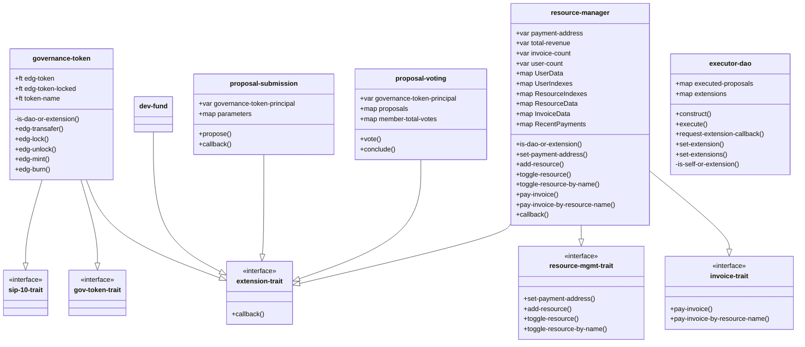

# eDAO Entity Structure

Goal is to define relationships between company, resources, invoices etc within the eDAO structure. Following are key assumptions;

1. resources are managed by resource manager
2. resource manager is managed by eDAO

### Class Diagram

