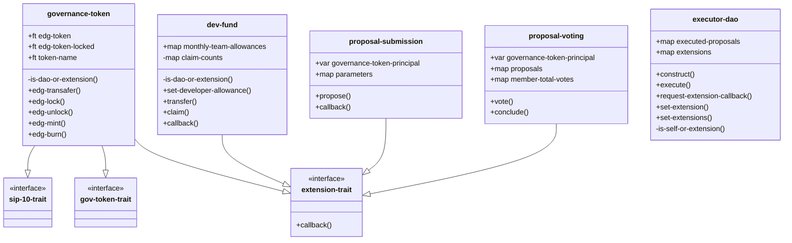

# Developer Fund Example

## Developer Fund

An example might be as a developer fund.&#x20;

The fund pays in governance token and does not show links with secondary markets for the token.

The extensions involved;

* ede000-governance-token : sip10 fungible tokens which facilitate voting via a governance token
* ede001-proposal-voting : implementation of user voting
* ede002-proposal-submission : submission of proposals
* ede005-dev-fund : claim functions for developers. setup and managed via proposals

### Class Overview




## Part 1: Deploying the Dev Fund

### Example Flow

<figure><figcaption></figcaption></figure>

The sequence above is how eDAO executes a simple dev fund proposal;

```
;; Title: EDP001-1 Dev Fund
;; Author: Mike Cohen
;; Synopsis:
;; Updates the simple dev fund for test purposes.
;; Description:
;; If this proposal passes, it mints new governance tokens equal to 30% of the total
;; supply and awards them to the EDE005 Dev Fund extension. It contains a number of
;; principals and set allowances. Any principal with an allowance is able to claim
;; an amount of tokens equal to the allowance on a (roughly) monthly basis.
;; Principals can be added and removed, and allowances can be changed via future
;; proposals.

(impl-trait .proposal-trait.proposal-trait)

(define-constant dev-fund-percentage u30)

(define-public (execute (sender principal))
	(let
		(
			(total-supply (unwrap-panic (contract-call? .ede000-governance-token get-total-supply)))
			(dev-fund-amount (/ (* total-supply dev-fund-percentage) u100))
		)
		;;(try! (contract-call? .ede005-dev-fund set-allowance-start-height block-height))
		(try! (contract-call? .ede005-dev-fund set-developer-allowances (list
			{who: 'ST2CY5V39NHDPWSXMW9QDT3HC3GD6Q6XX4CFRK9AG, start-height: block-height, allowance: u50}
			{who: 'ST2JHG361ZXG51QTKY2NQCVBPPRRE2KZB1HR05NNC, start-height: block-height, allowance: u0}
			{who: 'ST1SJ3DTE5DN7X54YDH5D64R3BCB6A2AG2ZQ8YPD5, start-height: block-height, allowance: u100}
			{who: 'ST2NEB84ASENDXKYGJPQW86YXQCEFEX2ZQPG87ND, start-height: block-height, allowance: u200}
			{who: 'STNHKEPYEPJ8ET55ZZ0M5A34J0R3N5FM2CMMMAZ6, start-height: block-height, allowance: u1}
			
		)))
		(try! (contract-call? .ede005-dev-fund transfer u500 'STNHKEPYEPJ8ET55ZZ0M5A34J0R3N5FM2CMMMAZ6 (some 0x7472616E736665722074657374)))
		(contract-call? .ede000-governance-token edg-mint dev-fund-amount .ede005-dev-fund)
	)
)
```

## Part 2: Claiming Funds

Dev fund can be claimed - if the user has an entry in the dev fund for the current period they simply call claim on the dev fund contract
