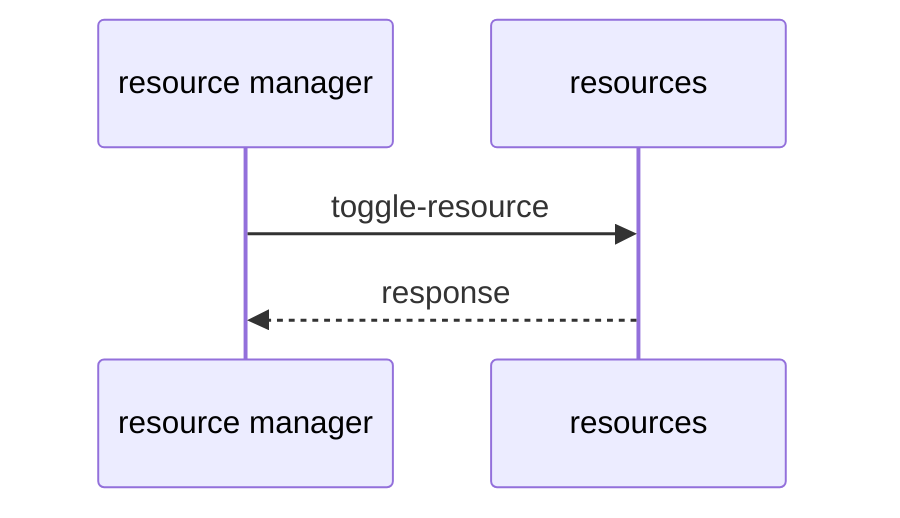
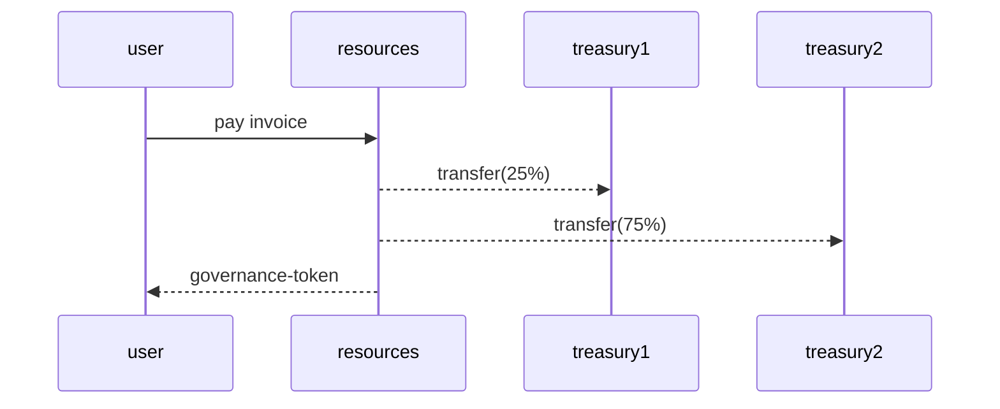
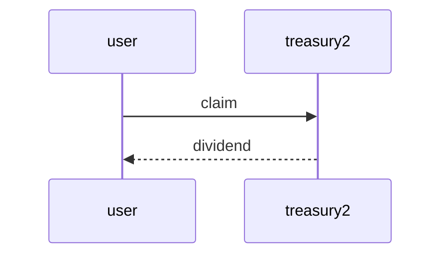

# eDAO Sequence Diagrams

Defines the flows (at contract level) which enact the use cases.

### Manage Resources

````mermaid
# Sequence Diagram 1


````

#### Add resource


#### Toggle resource



### Make Payments

#### Purchase governance token

````mermaid

````

#### Claim dividend




