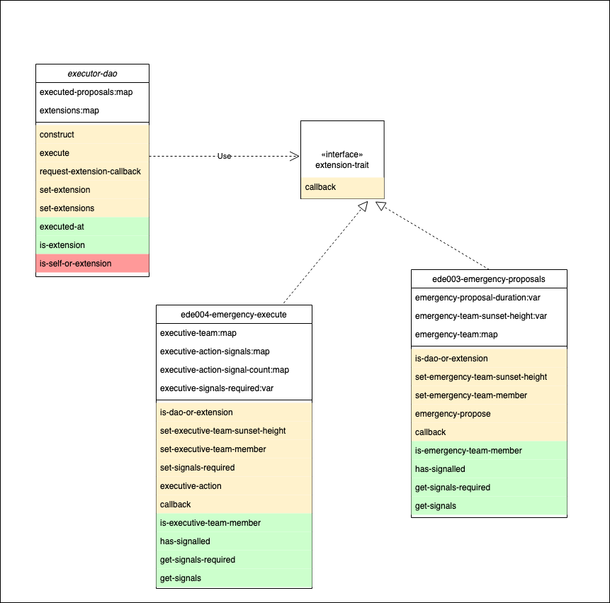

# Emergency Measures

## Emergency Propose and Execute Extensions

The DAO has two mechanisms built in to facilitate the operational on-boarding. These are emergency execution and emergency proposals.

<figure><figcaption></figcaption></figure>

**Emergency Execute Extension**

Defines an executive team with the ability to bypass the DAO voting extension and a built in sunset period.&#x20;

* executive team can be set up for a configurable amount of time
* the executive team can, on reaching the requisite number of signals, skip voting and immediately execute any proposal.

**Emergency Propose Extension**

Defines an emergency team with the ability to make proposals and a built in sunset period.

