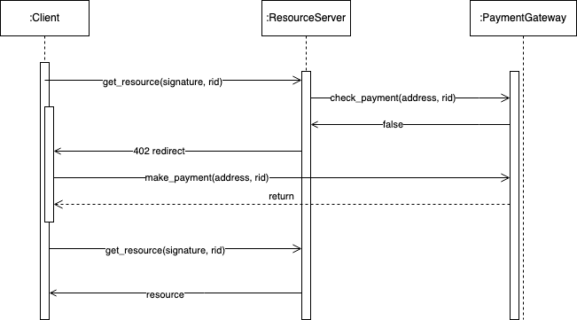

# Purchase Resource

## Resource Payment Flow

Resource payment flow

1. User signs a message and sends it to the resource server along with a resource id to make an unsuccessful request (payment required) for the resource
2. Resource server determines if payment has been made in the payment gateway
3. Resource server sends a 402 redirect to client redirecting them to payment gateway
4. User pays
5. User makes another successful request to resource server for resource

<figure><figcaption></figcaption></figure>

